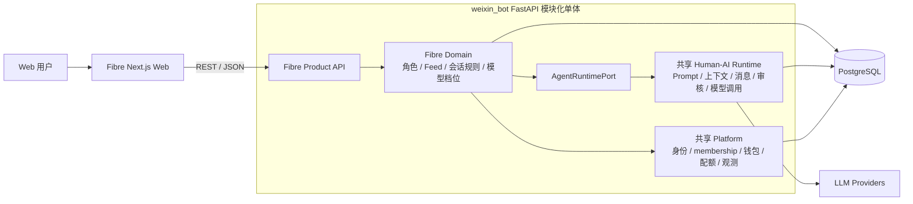
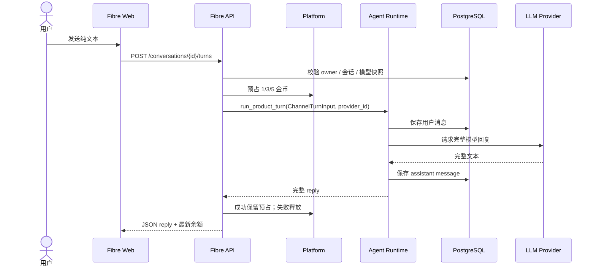

# Fibre Chat MVP 总体技术架构

> 文档编号：TECH-01
> 版本：v0.3
> 状态：MVP 实现与联调基线
> 日期：2026-08-06
> 产品基线：[PRD-MVP-v0.1](./PRD-MVP-v0.1.md)

## 1. 架构结论

Fibre Chat 采用“独立 Web 前端 + 现有 FastAPI 模块化单体中的 Fibre 产品域”架构：

- 前端仍为独立的 Next.js 响应式 Web。
- 后端不新建 Fibre 服务，接入 `/Users/suchong/workspace/ai4all/weixin_bot`。
- Fibre 是与 `zhaoxi`、`mingchan` 平级的产品，固定 `app_id=fibre`。
- 人—AI 对话核心及业务无关技术能力复用现有 Agent Runtime 和 Platform。
- 角色、Feed、会话产品规则和产品模型档位留在 Fibre 产品域。
- PostgreSQL 是生产事实源；SQLite 只保留开发和测试路径。
- 首版 turn 使用同步 JSON；SSE/流式 Runtime 作为后续增强，不属于本期交付。

具体方案见：

- [TECH-02 前端技术方案](./TECH-02-frontend.md)
- [TECH-03 后端技术方案](./TECH-03-backend-agent-integration.md)

## 2. 架构目标

- 跑通“测试账号进入 → 浏览角色 → 同步文字聊天 → 切换模型 → 扣模拟金币 → 恢复历史”。
- 最大化复用真正通用的人—AI 对话能力，不把其他 App 的业务概念强行共享。
- 保证 session、runtime account、钱包、配额和数据按 `app_id=fibre` 隔离。
- 真实模型可替换，浏览器只感知 `fast/balanced/immersive`。
- 不引入新的微服务、消息队列、Redis 或供应商 SDK 作为 MVP 前置条件。

非目标：

- 不复用或改造成“通用 Feed 平台”。
- 不复制鸣蝉 World/居民模型或朝夕 onboarding/主动消息。
- 不建设支付、订阅、推荐算法、多模态、长期记忆管理或创作者后台。

## 3. 总体结构



部署上 Fibre API、Platform 与 Agent Runtime 在同一 FastAPI 进程中；它们保持逻辑边界，但不为逻辑分层额外拆服务。

## 4. 模块职责

| 层 | 负责 | 不负责 |
| --- | --- | --- |
| Fibre Web | Feed/聊天页面、同步请求状态、错误恢复 | 可信余额、Prompt、模型密钥、扣费事实 |
| Fibre 产品域 | 角色与 Feed、会话业务规则、产品模型档位、API DTO | 供应商协议、共享 wallet 实现、其他产品业务 |
| Agent Runtime | 通用 turn、session/messages、Prompt、上下文、审核、模型调用 | Fibre Feed、角色上架、金币价格、产品页面文案 |
| Platform | 身份、membership、runtime owner、钱包、预占/账本、配额、锁和观测 | 角色设定、Feed 排序、模型产品命名 |
| PostgreSQL | 所有生产业务和运行状态 | 临时 UI 状态 |

依赖方向：

```text
API adapter → Fibre application/domain → AgentRuntimePort → Runtime
                            └───────────→ Platform ports
```

Runtime 不 import 产品包；Fibre 不 import 朝夕或鸣蝉实现。

## 5. 关键技术决策

### ADR-001：Fibre 是模块化单体内的独立产品域

新增 `app/products/fibre/`，在服务端注册表和 composition root 显式注册。公开接口只挂载于：

```text
/api/v1/products/fibre/*
```

不使用 Header 动态选择产品，不复制旧 `/web/*` 或其他产品兼容入口。

### ADR-002：只抽象通用人—AI 对话，不抽象 App 业务

共享层承载输入、消息、上下文、Prompt、审核、模型和终结状态。角色、Feed、开场白、模型产品档位和重新开始规则由 Fibre 自己定义。

若一个能力只被某个产品需要，默认保留在该产品域；只有确认其语义跨产品且业务中性时才进入 Runtime 或 Platform。

### ADR-003：首版直接复用现有同步 Runtime

当前 `run_product_turn()` 已是整段回复模式，首版直接复用：

```text
prepare → persist/screen → prompt → model → finalize
```

Fibre 通过 `ChannelTurnInput` 传入产品选择的 `provider_id`，同步返回完整 reply。不能在 Fibre 内重写 Prompt、上下文或消息终结逻辑。后续若增加流式，应在共享 Runtime 做加性扩展，不能新增 Fibre 私有对话引擎。

### ADR-004：角色对话复用 runtime account/session/messages

- 为“预置测试用户 × 角色”创建隔离的 runtime account；数据模型仍保留 `platform_user_id` 作用域，避免将单用户假设写死在业务表中。
- 角色人设版本写入该 account 的 profile/context files。
- Fibre conversation 指向共享 runtime session。
- 对话正文只保存在共享 `messages`；Fibre 不新建重复的 messages 表。
- 重新开始归档当前 session 并创建新 session，旧消息不进入新 Prompt。

### ADR-005：产品模型档位与共享 provider 解耦

Fibre 保存：

```text
fast / balanced / immersive
→ provider_id + 展示文案 + 1/3/5 金币 + 配置版本
```

共享 LLM 层仍使用 `LLMProviderConfig`。用户选择不能修改全局 family/tier，避免影响其他产品；每个已受理 turn 快照 provider 与价格。

### ADR-006：复用产品钱包，增加通用预占

现有钱包按 `(platform_user_id, app_id)` 隔离，新客赠送常量正好为 1000。Fibre 仅把显示单位称为“金币”：

```text
1 金币 = 1 shell = 1,000,000 shell_micros
```

固定 1/3/5 金币价格属于 Fibre；并发安全的 reservation/release 属于 Platform。预占即形成固定价格扣款，成功时保留，失败时幂等释放。Fibre 关闭 Runtime 的按 token 计费，避免双重扣费。

### ADR-007：本地 MVP 使用预置测试账号

MVP 不修改 `platform_users.phone`，不实现注册、登录或匿名身份。开发 seed 幂等创建固定测试用户、Fibre membership、入口 account 和钱包；Fibre 依赖在 `local/test` 环境直接构造该用户的固定 principal。

该入口不签发 Cookie，也不接受浏览器传入 user ID。只要 `app_env` 不是 `local/test` 或未显式打开 `FIBRE_DEV_MODE`，依赖必须 fail closed。进入多人测试或公开部署前，再接入正式身份方案。

### ADR-008：PostgreSQL 是生产一致性权威

- 生产并发依赖事务、条件更新、唯一约束和 advisory lock。
- SQLite 仅用于 dev/test，保持同一 repository 契约和迁移可运行。
- 不在数据库事务中等待 LLM。
- 不把 LocalStorage、进程内锁或内存余额当作生产事实。

## 6. 核心调用流程



失败时 Runtime 标记 run 失败，Platform 释放预占，不生成消费流水。

## 7. 数据所有权

| 数据 | 所属模块 | 主要隔离键 |
| --- | --- | --- |
| 测试用户、membership | Platform | `platform_user_id + app_id` |
| runtime account 所有权 | Platform | `runtime_account_id + app_id` |
| wallet、ledger、reservation、cost | Platform | `platform_user_id + app_id` |
| session、messages、turn run | Agent Runtime | `account_id + session_id` |
| 角色和私有 Prompt 资产 | Fibre | `character_id` |
| 角色绑定 | Fibre | `platform_user_id + character_id` |
| Feed 排序 | Fibre | Fibre 角色表 |
| conversation 和模型选择 | Fibre | `platform_user_id + conversation_id` |

所有权解析采用共享 `runtime_ownerships` 投影，避免共享层识别 Fibre 表或继续扩大历史产品特例。

## 8. API 与协议

基础路径：

```text
/api/v1/products/fibre
```

API 组：

- `/bootstrap`、`/wallet`
- `/feed`、`/characters/{id}`
- `/conversations`、`/conversations/{id}/messages`
- `/conversations/{id}/turns`

所有查询和写入均使用 JSON REST；聊天 `POST` 在生成完成后返回 reply、实际扣费、最新余额和幂等状态。

前端只依据稳定错误码执行交互，不依赖中文错误文案。

## 9. 安全与隐私

- 角色私有 Prompt 不进入公开 DTO、日志或前端 bundle。
- 浏览器不能提交可信 user ID；测试 principal 只能由服务端本地配置产生。
- `FIBRE_DEV_MODE` 在非 `local/test` 环境 fail closed；本地后端默认只绑定 loopback。
- CORS 仅允许正式 Web 源；生产优先同域反向代理。
- 用户不能提交 provider ID、真实模型 ID、价格或 user ID 作为可信值。
- 所有 owner 查询使用服务端 principal，并同时约束产品、用户和 runtime account。
- 日志不记录 API key、完整 system prompt 和敏感对话正文。
- 模型完整输出在返回前经过内容安全校验。

## 10. 可观测性

每个 turn 至少记录：

- `request_id`、`turn_id`、`app_id`、conversation、account/session。
- model profile、provider ID、模型快照版本。
- 请求开始、完整回复耗时和 finish reason。
- 输入/输出 token、预占/核销结果、余额变化。
- 幂等命中、busy、余额不足、provider/审核错误码。

核心指标：turn 成功率、总延迟、重复请求率、预占释放率、余额不一致数，以及 PRD 定义的 Feed 点击与聊天转化。

## 11. 部署拓扑


部署要求：

- API 与 Web 本地跨端口联调时只允许明确的开发源；后续部署优先同域。
- 反向代理为同步生成配置合理的请求超时。
- `FIBRE_ENABLED` 独立控制上线，不影响其他产品。
- migration 由 central 显式执行；普通 worker 不自动跑生产 DDL。
- MVP 不引入 Redis、队列或单独的生成服务。

## 12. 交付路径

1. Platform 基础：测试账号 seed、开发态 principal、runtime ownership、产品钱包预占。
2. Fibre 产品域：角色/Feed、绑定、conversation、模型档位和 2 个 seed 角色。
3. Agent Runtime：复用通用对话引擎，并支持每个 turn 显式选择 provider 与外部固定价计费。
4. 端到端：同步回复、成功保留预占、失败释放、刷新恢复、重新开始。
5. 双后端测试：SQLite 功能回归、PostgreSQL 并发与 migration 验收。
6. 前后端联调后再打开 `FIBRE_ENABLED`。

## 13. 架构验收标准

- Fibre API 只能使用 Fibre session；其他产品 token 无法越权。
- Runtime、Platform 不出现 Fibre import 或 `app_id == "fibre"` 业务分支。
- Fibre 不 import 朝夕、鸣蝉实现。
- Feed 和角色仍为 Fibre 私有业务模型。
- Fibre 与既有产品使用同一同步对话核心，Runtime 不感知 Fibre 模型档位。
- 新用户只获得一次 1000 金币；任意并发下余额不为负且不重复扣费。
- 消息、session、钱包、owner 和配置均有明确作用域。
- 关闭 Fibre feature flag 不影响现有产品。
