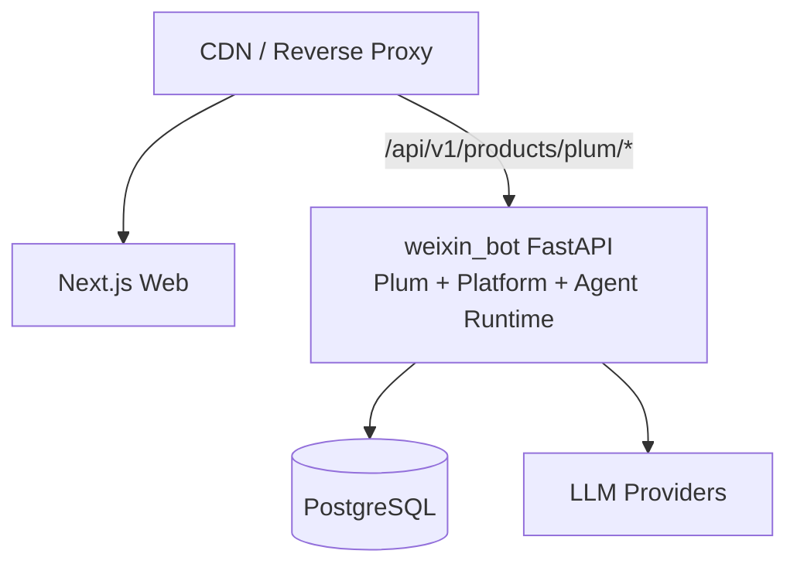

# Plum Chat MVP 总体技术架构

> 文档编号：TECH-01
> 版本：v0.3
> 状态：MVP 实现与联调基线
> 日期：2026-08-06
> 产品基线：[PRD-MVP-v0.1](./PRD-MVP-v0.1.md)

## 1. 架构结论

Plum Chat 采用“独立 Web 前端 + 现有 FastAPI 模块化单体中的 Plum 产品域”架构：

- 前端仍为独立的 Next.js 响应式 Web。
- 后端不新建 Plum 服务，接入 `/Users/suchong/workspace/ai4all/weixin_bot`。
- Plum 是与 `zhaoxi`、`mingchan` 平级的产品，固定 `app_id=plum`。
- 人—AI 对话核心及业务无关技术能力复用现有 Agent Runtime 和 Platform。
- 角色、Feed、会话产品规则和产品模型档位留在 Plum 产品域。
- PostgreSQL 是生产事实源；SQLite 只保留开发和测试路径。
- 首版 turn 使用同步 JSON；SSE/流式 Runtime 作为后续增强，不属于本期交付。

具体方案见：

- [TECH-02 前端技术方案](./TECH-02-frontend.md)
- [TECH-03 后端技术方案](./TECH-03-backend-agent-integration.md)
- [TECH-07 公网多人内测身份方案（路线 B）](./TECH-07-public-test-auth.md)

## 2. 架构目标

- 跑通“测试账号进入 → 浏览角色 → 同步文字聊天 → 切换模型 → 扣模拟金币 → 恢复历史”。
- 最大化复用真正通用的人—AI 对话能力，不把其他 App 的业务概念强行共享。
- 保证 session、runtime account、钱包、配额和数据按 `app_id=plum` 隔离。
- 真实模型可替换，浏览器只感知 `fast/balanced/immersive`。
- 不引入新的微服务、消息队列、Redis 或供应商 SDK 作为 MVP 前置条件。

非目标：

- 不复用或改造成“通用 Feed 平台”。
- 不复制鸣蝉 World/居民模型或朝夕 onboarding/主动消息。
- 不建设支付、订阅、推荐算法、多模态、长期记忆管理或创作者后台。

## 3. 总体结构


部署上 Plum API、Platform 与 Agent Runtime 在同一 FastAPI 进程中；它们保持逻辑边界，但不为逻辑分层额外拆服务。

## 4. 模块职责

| 层 | 负责 | 不负责 |
| --- | --- | --- |
| Plum Web | Feed/聊天页面、同步请求状态、错误恢复 | 可信余额、Prompt、模型密钥、扣费事实 |
| Plum 产品域 | 角色与 Feed、会话业务规则、产品模型档位、API DTO | 供应商协议、共享 wallet 实现、其他产品业务 |
| Agent Runtime | 通用 turn、session/messages、Prompt、上下文、审核、模型调用 | Plum Feed、角色上架、金币价格、产品页面文案 |
| Platform | 身份、membership、runtime owner、钱包、预占/账本、配额、锁和观测 | 角色设定、Feed 排序、模型产品命名 |
| PostgreSQL | 所有生产业务和运行状态 | 临时 UI 状态 |

依赖方向：

```text
API adapter → Plum application/domain → AgentRuntimePort → Runtime
                            └───────────→ Platform ports
```

Runtime 不 import 产品包；Plum 不 import 朝夕或鸣蝉实现。

## 5. 关键技术决策

### ADR-001：Plum 是模块化单体内的独立产品域

新增 `app/products/plum/`，在服务端注册表和 composition root 显式注册。公开接口只挂载于：

```text
/api/v1/products/plum/*
```

不使用 Header 动态选择产品，不复制旧 `/web/*` 或其他产品兼容入口。

### ADR-002：只抽象通用人—AI 对话，不抽象 App 业务

共享层承载输入、消息、上下文、Prompt、审核、模型和终结状态。角色、Feed、开场白、模型产品档位和重新开始规则由 Plum 自己定义。

若一个能力只被某个产品需要，默认保留在该产品域；只有确认其语义跨产品且业务中性时才进入 Runtime 或 Platform。

### ADR-003：首版直接复用现有同步 Runtime

当前 `run_product_turn()` 已是整段回复模式，首版直接复用：

```text
prepare → persist/screen → prompt → model → finalize
```

Plum 通过 `ChannelTurnInput` 传入产品选择的 `provider_id`，同步返回完整 reply。不能在 Plum 内重写 Prompt、上下文或消息终结逻辑。后续若增加流式，应在共享 Runtime 做加性扩展，不能新增 Plum 私有对话引擎。

### ADR-004：角色对话复用 runtime account/session/messages

- 为“预置测试用户 × 角色”创建隔离的 runtime account；数据模型仍保留 `platform_user_id` 作用域，避免将单用户假设写死在业务表中。
- 角色人设版本写入该 account 的 profile/context files。
- Plum conversation 指向共享 runtime session。
- 对话正文只保存在共享 `messages`；Plum 不新建重复的 messages 表。
- 重新开始归档当前 session 并创建新 session，旧消息不进入新 Prompt。

### ADR-005：产品模型档位与共享 provider 解耦

Plum 保存：

```text
fast / balanced / immersive
→ provider_id + 展示文案 + 1/3/5 金币 + 配置版本
```

共享 LLM 层仍使用 `LLMProviderConfig`。用户选择不能修改全局 family/tier，避免影响其他产品；每个已受理 turn 快照 provider 与价格。

### ADR-006：复用产品钱包，增加通用预占

现有钱包按 `(platform_user_id, app_id)` 隔离，新客赠送常量正好为 1000。Plum 仅把显示单位称为“金币”：

```text
1 金币 = 1 shell = 1,000,000 shell_micros
```

固定 1/3/5 金币价格属于 Plum；并发安全的 reservation/release 属于 Platform。预占即形成固定价格扣款，成功时保留，失败时幂等释放。Plum 关闭 Runtime 的按 token 计费，避免双重扣费。

### ADR-007：公网内测采用“一人一码 + Cookie Session”

公网测试不使用匿名身份，也暂不引入手机号/SMS。每个高熵邀请码绑定一个稳定的 `platform_user`；首次兑换时幂等创建 Plum membership、入口 account、钱包和 1000 金币，后续使用同一码可恢复原账号。

服务端签发 HttpOnly session Cookie，并用独立可读 CSRF Cookie + `X-Plum-CSRF` 保护写请求。所有钱包、会话、消息、互动和 Persona 均按用户隔离。固定开发账号只作为 `local/development/test + PLUM_DEV_MODE` fallback，生产环境必须关闭。

### ADR-008：PostgreSQL 是生产一致性权威

- 生产并发依赖事务、条件更新、唯一约束和 advisory lock。
- SQLite 仅用于 dev/test，保持同一 repository 契约和迁移可运行。
- 不在数据库事务中等待 LLM。
- 不把 LocalStorage、进程内锁或内存余额当作生产事实。

## 6. 核心调用流程


失败时 Runtime 标记 run 失败，Platform 释放预占，不生成消费流水。

## 7. 数据所有权

| 数据 | 所属模块 | 主要隔离键 |
| --- | --- | --- |
| 测试用户、membership | Platform | `platform_user_id + app_id` |
| runtime account 所有权 | Platform | `runtime_account_id + app_id` |
| wallet、ledger、reservation、cost | Platform | `platform_user_id + app_id` |
| session、messages、turn run | Agent Runtime | `account_id + session_id` |
| 角色和私有 Prompt 资产 | Plum | `character_id` |
| 角色绑定 | Plum | `platform_user_id + character_id` |
| Feed 排序 | Plum | Plum 角色表 |
| conversation 和模型选择 | Plum | `platform_user_id + conversation_id` |

所有权解析采用共享 `runtime_ownerships` 投影，避免共享层识别 Plum 表或继续扩大历史产品特例。

## 8. API 与协议

基础路径：

```text
/api/v1/products/plum
```

API 组：

- `/bootstrap`、`/wallet`
- `/feed`（`limit` / `cursor` / `q` / `tags` / `gender` / `rating`，见 §8.1）、`/characters/{id}`
- `/conversations`、`/conversations/{id}/messages`
- `/conversations/{id}/turns`
- `/client-events`（浏览器故障上报，见 §10.1）

所有查询和写入均使用 JSON REST；聊天 `POST` 在生成完成后返回 reply、实际扣费、最新余额和幂等状态。

前端只依据稳定错误码执行交互，不依赖中文错误文案。

### 8.1 `GET /feed` 契约

| 参数 | 取值 | 说明 |
| --- | --- | --- |
| `limit` | 1–48，默认 24 | 单页条数 |
| `cursor` | 上一页返回的 `next_cursor` | **不透明**；客户端不解析、不构造 |
| `q` | ≤64 字符 | 服务端匹配名称、一句话、简介、标签 |
| `tags` | 重复参数，≤8 个 | **全部命中**才算匹配（与前端 `every` 同义） |
| `gender` | `male` / `female` / `non_binary` | 匹配 `plum_characters.gender`；不传 = 不筛 |
| `rating` | `general` / `mature` | 匹配 `plum_characters.content_rating`；不传 = 不筛 |

响应固定为 `{status, items, next_cursor}`，`next_cursor` 为 `null` 表示到底。

- **分页是 keyset 不是 OFFSET**：`WHERE (sort_order, id) > (?, ?)` 走
  `ix_plum_characters_feed`，第 100 页与第 1 页同价；翻页过程中上架新角色也不会漏条或重复。
- **游标不透明是弹性来源**：以后加 `sort=popular` 换排序键时，只要新旧 token 各自能解出位置，
  客户端一行都不用改。`?offset=N` 一旦发出去就锁死实现，而且深页是 O(N)。
- **错误码**：游标解不开返回 400 `invalid_cursor`（不静默退回第一页，否则"翻着翻着回到开头"
  永远没人发现）；`tags` 超过 8 个返回 400 `too_many_tags`；`gender`/`rating` 不在枚举内返回
  400 `invalid_gender` / `invalid_rating`。空值（`cursor=` / `gender=` / `rating=`）一律视为
  "这一项不筛"，正常返回——`?cursor=${next ?? ""}` 这类客户端写法很常见。**枚举校验放在 API
  边界**，留给 repository 的 `ValueError` 只剩游标一个来源，错误码才不会互相串味。
- **缓存分叉**：未筛选、未翻页的第一页对所有人字节相同（响应里没有任何账号态），下发
  `Cache-Control: public, max-age=60`；带 `q`/`tags`/`gender`/`rating`/`cursor` 的响应是长尾，
  命中率低且会污染中间层，一律 `no-store`。
- **`gender` 为空的历史角色筛不到，这是对的**：参考期那批角色早于 `gender` 列，值是 `NULL`，
  `gender = ?` 永远不命中。补数据的地方是角色表，不是放宽查询条件——为了让筛选"看起来有结果"
  而把 NULL 也算进某个性别，是在答案里造假。
- **关联数据整页批量取**：creator / stats / badges 原来是每个角色 3 条附加查询（一页 24 个
  = 73 次往返），现在固定 4 次。
- **`q` 第一版是 `ILIKE '%…%'`**，接受全表扫描（当前目录十几条）。升级路径是 `pg_trgm` + GIN
  索引，届时**接口形状不变**。用户输入里的 `%` `_` `\` 在服务端转义——不转义既是错误结果
  （搜 `%` 匹配全表），也是让每次按键都退化成全表扫描的放大器。

## 9. 安全与隐私

- 角色私有 Prompt 不进入公开 DTO、日志或前端 bundle。
- 浏览器不能提交可信 user ID；测试 principal 只能由服务端本地配置产生。
- `PLUM_DEV_MODE` 在非 `local/test` 环境 fail closed；本地后端默认只绑定 loopback。
- CORS 仅允许正式 Web 源；生产优先同域反向代理。
- 用户不能提交 provider ID、真实模型 ID、价格或 user ID 作为可信值。
- 所有 owner 查询使用服务端 principal，并同时约束产品、用户和 runtime account。
- 日志不记录 API key、完整 system prompt 和敏感对话正文。
- 模型完整输出在返回前经过内容安全校验。

## 10. 可观测性

每个 turn 至少记录：

- `request_id`、`turn_id`、`app_id`、conversation、account/session。
- model profile、provider ID、模型快照版本。
- 请求开始、完整回复耗时和 finish reason。
- 输入/输出 token、预占/核销结果、余额变化。
- 幂等命中、busy、余额不足、provider/审核错误码。

核心指标：turn 成功率、总延迟、重复请求率、预占释放率、余额不一致数，以及 PRD 定义的 Feed 点击与聊天转化。

### 10.1 客户端故障可见性

服务端日志看不到浏览器里发生的事——`STREAM_TRUNCATED`（流在中途断掉）是核心对话链路唯一的
健康信号，而它只存在于客户端。`POST /client-events` 补这一个洞，只收故障，不是埋点通道。

- **契约是闭合 schema**（`ClientEvent`，`extra="forbid"`，没有 `props` 之类自由字段）。这不是
  洁癖：留一个自由字典，前端任何一次改动都可能开始往服务端日志里灌聊天正文，而那种泄漏不可逆。
  要加字段就显式改契约。字符串字段在校验阶段去掉换行和控制字符，否则浏览器给的值能在单行日志
  里伪造出额外的字段和行。
- **鉴权用 `optional_plum_actor` + 同源校验，不要求 CSRF**。游客落地时还没有 CSRF cookie，
  而最值得看到的故障恰恰是"鉴权本身坏了"的那些；要求 CSRF 会把它们全筛掉。同源校验保证只有
  我们自己的页面能写入。
- **限流用进程内固定窗口，刻意不用 `RateLimiter`**：`check_rpm` 每放行一次请求就往 `rpm_hits`
  插一行，而清理只发生在同一个 key 再回来的时候，仓库里没有任何 sweeper。把基数最高的端点挂
  上去等于让那张表无界增长。这里保护的是日志量，不是用户可见配额，进程内预算就够。
- **永远返回 202**，预算用满、事件被丢也一样。客户端因此可以发完就忘，不处理 429、不重试；
  否则一次后端故障会让每个打开的标签页都开始重试上报，把故障放大一轮。
- 相同失败在客户端合并成一条并带 `count`，不做随机采样——采样会让"出现 1 次"和"出现 1000 次"
  都变成"1 次"，而量级正是唯一有用的信息。

第一版落成单行结构化日志（`logger.warning("plum client event ...")`），不建表：先拿到"能看见
生产故障"这个能力，等确定要按什么维度聚合再谈存储和保留期。前端实现见 TECH-02 §18。

## 11. 部署拓扑



部署要求：

- API 与 Web 本地跨端口联调时只允许明确的开发源；后续部署优先同域。
- 反向代理为同步生成配置合理的请求超时。
- `PLUM_ENABLED` 独立控制上线，不影响其他产品。
- migration 由 central 显式执行；普通 worker 不自动跑生产 DDL。
- MVP 不引入 Redis、队列或单独的生成服务。

## 12. 交付路径

1. Platform 基础：测试账号 seed、开发态 principal、runtime ownership、产品钱包预占。
2. Plum 产品域：角色/Feed、绑定、conversation、模型档位和 2 个 seed 角色。
3. Agent Runtime：复用通用对话引擎，并支持每个 turn 显式选择 provider 与外部固定价计费。
4. 端到端：同步回复、成功保留预占、失败释放、刷新恢复、重新开始。
5. 双后端测试：SQLite 功能回归、PostgreSQL 并发与 migration 验收。
6. 前后端联调后再打开 `PLUM_ENABLED`。

## 13. 架构验收标准

- Plum API 只能使用 Plum session；其他产品 token 无法越权。
- Runtime、Platform 不出现 Plum import 或 `app_id == "plum"` 业务分支。
- Plum 不 import 朝夕、鸣蝉实现。
- Feed 和角色仍为 Plum 私有业务模型。
- Plum 与既有产品使用同一同步对话核心，Runtime 不感知 Plum 模型档位。
- 新用户只获得一次 1000 金币；任意并发下余额不为负且不重复扣费。
- 消息、session、钱包、owner 和配置均有明确作用域。
- 关闭 Plum feature flag 不影响现有产品。
