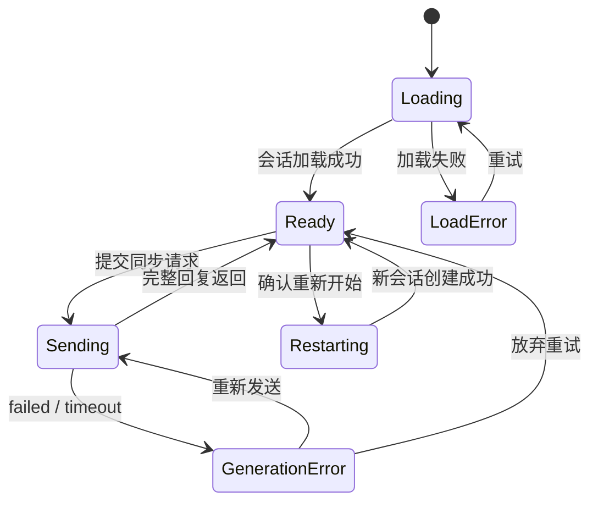

# Plum Chat MVP 前端技术方案

> 文档编号：TECH-02
> 版本：v0.3
> 状态：MVP 实现与联调基线
> 日期：2026-08-06
> 上游文档：[PRD](./PRD-MVP-v0.1.md) · [总体架构](./TECH-01-architecture.md)

## 1. 目标与边界

前端负责两个核心页面：主 Feed 和角色聊天页。重点保证响应式体验、同步消息等待状态、模型切换、余额同步和错误恢复。首版不做 SSE 流式展示。

前端不承担以下职责：

- 不计算可信金币余额，不自行决定最终扣费。
- 不保存角色私有提示词或模型供应商配置。
- 不直接调用模型供应商或 Agent 框架。
- 不把 LocalStorage 作为消息、会话或用户身份的业务事实来源。

## 2. 推荐技术栈

| 类别 | 选择 | 用途 |
| --- | --- | --- |
| 应用框架 | Next.js App Router + TypeScript | 路由、服务端首屏、构建和部署 |
| UI 样式 | 原生 CSS + CSS Variables | 响应式布局和主题 token |
| 服务端状态 | 页面级 React state | Feed、会话、余额与错误状态 |
| 本地交互状态 | React state | 输入草稿、重开弹层、发送状态 |
| API 封装 | typed `fetch` wrapper | JSON 请求、统一错误处理 |
| 静态验证 | TypeScript + Next production build | 类型和构建兼容性 |
| 端到端测试 | Playwright | Feed 到聊天、模型切换、失败重试 |
| API 契约 | 手写 TypeScript 类型 | 对齐当前固定 Plum JSON API |

MVP 不引入 Redux/Zustand/TanStack Query。页面级 state 足以覆盖当前范围；出现跨页面缓存或复杂编辑状态后再升级。

## 3. 路由与渲染策略

| 路由 | 页面 | 渲染建议 |
| --- | --- | --- |
| `/` | 主 Feed | 服务端渲染公开角色数据，客户端加载测试账号 bootstrap 与余额 |
| `/chat/[characterId]` | 角色聊天 | 客户端主导；加载测试账号后获取或创建当前角色会话 |

### 3.1 Feed

- 角色公开数据可服务端获取，尽快输出首屏卡片。
- 金币余额属于用户数据，在客户端会话初始化完成后展示。
- 如果服务端渲染会显著增加现有部署复杂度，可先退化为客户端请求，但组件和 API 不变。

### 3.2 聊天页

- 聊天依赖本地后端提供的测试账号 bootstrap 和持续交互，采用 Client Component 为主。
- 首次加载时调用“获取或创建活跃会话”接口。
- 历史消息分页从最新页开始加载；MVP 数据量很小时也可一次返回，接口仍保留游标字段。

## 4. 建议目录结构

```text
plum_chat/
├── app/
│   ├── layout.tsx
│   ├── page.tsx
│   └── chat/[characterId]/
│       └── page.tsx
├── components/
│   └── brand.tsx
├── lib/
│   ├── api.ts
│   └── types.ts
└── docs/
```

原则：页面负责当前 MVP 的数据编排；可复用视觉放在 `components`；HTTP 与类型集中在 `lib`。业务复杂度增长后再拆 `features`。

## 5. 前端领域类型

以下为前端公开类型的建议形态，最终从共享契约生成或对齐：

```ts
type ModelProfile = "fast" | "balanced" | "immersive";

type CharacterSummary = {
  id: string;
  displayName: string;
  tagline: string;
  tags: string[];
  avatarUrl: string | null;
  coverUrl: string | null;
  heatCount: number;
};

type ChatMessage = {
  id: string;
  clientMessageId: string | null;
  role: "user" | "assistant";
  content: string;
  status: "pending" | "completed" | "failed";
  modelProfile: ModelProfile | null;
  createdAt: string;
  errorCode?: string;
};

type Conversation = {
  id: string;
  character: CharacterSummary;
  modelProfile: ModelProfile;
  status: "active" | "archived";
  messages: ChatMessage[];
};

type SessionSnapshot = {
  user: { id: string };
  coinBalance: number;
  models: ModelOption[];
};
```

前端类型中不出现 `systemPrompt`、供应商模型 ID、供应商密钥或金币账本内部字段。

## 6. 状态分层

### 6.1 服务端状态

由页面级 React state 管理：

| Query Key | 内容 | 失效时机 |
| --- | --- | --- |
| `['bootstrap']` | 测试用户、余额、模型配置 | turn 完成、页面恢复 |
| `['characters']` | Feed 角色列表 | 手动刷新或短周期 stale |
| `['conversation', characterId]` | 当前活跃会话与消息 | 发送完成、重试、重新开始 |

### 6.2 本地状态

- 当前输入草稿。
- 模型选择弹层开关。
- 角色简介折叠状态。
- 当前发送/生成中的布尔状态。
- 页面滚动锚点和“有新消息”提示。

### 6.3 不持久化状态

- Toast 和弹层状态。

输入草稿可以按 `conversationId` 临时保存到 `sessionStorage`，但不属于 MVP 必需项。

## 7. 测试账号初始化

前端根布局加载后执行一次：

1. 调用 `GET /api/v1/products/plum/bootstrap`。
2. 已登录时服务端从 HttpOnly Cookie 解析 Plum principal；未登录返回 `401`，前端展示邀请码弹层。
3. 返回 `coin_balance` 和已启用模型档位。
4. 将结果写入 `['bootstrap']` Query Cache。
5. 请求期间余额位置显示骨架，不把 1000 写死在前端。

如果会话初始化失败：

- `401` 进入邀请码兑换流程，成功后重新加载 bootstrap 与 Feed。
- 其他错误展示可重试错误态。
- 不在客户端生成或提交临时用户 ID 来绕过服务端。

所有请求使用同源 `/api/v1/products/plum/*`。浏览器自动携带 HttpOnly session；非 GET 请求从 `plum_csrf` Cookie 读取 token，并发送 `X-Plum-CSRF`。聊天页遇到 `401` 返回首页登录态。

## 8. Feed 页面实现

### 8.1 组件树

```text
FeedPage
├── AppHeader
│   ├── Brand
│   └── CoinBalance
├── FeedHero
└── CharacterGrid
    └── CharacterCard × N
```

### 8.2 CharacterCard

输入仅为 `CharacterSummary` 和 `position`，负责：

- 展示封面、头像、名称、钩子、标签和格式化热度。
- 无图片时使用由角色 ID 稳定生成的渐变背景，避免每次刷新变化。
- 整张主要区域可点击，支持键盘焦点与 Enter 激活。
- 点击前记录 `character_card_click`，埋点失败不得阻塞跳转。

### 8.3 页面状态

- `loading`：卡片骨架尺寸与真实卡片一致，减少布局跳动。
- `empty`：展示明确文案，不出现创建角色入口。
- `error`：保留页面框架，提供重试按钮。
- `success`：按服务端 `sort_order` 结果展示，前端不重新排序。

## 9. 聊天页面实现

### 9.1 组件树

```text
ChatPage
├── ChatHeader
│   ├── BackButton
│   ├── CharacterIdentity
│   ├── CoinBalance
│   └── RestartMenu
├── CharacterIntro
├── ChatMessageList
│   └── ChatMessage × N
└── ChatComposer
    ├── ModelSelector
    ├── Textarea
    └── SendButton
```

### 9.2 聊天状态机



状态约束：

- `Sending` 时发送按钮、模型选择和重新开始入口禁用。
- 加载历史失败时不展示可发送的空聊天框，避免创建未知状态的会话。
- 生成失败后保留用户消息，并在其后展示失败的 AI 消息占位。

## 10. 发送与同步响应

### 10.1 发送前校验

- `trim()` 后不能为空。
- 长度不超过 2000 个 Unicode 字符；服务端仍需二次校验。
- 当前无生成任务。
- `coinBalance >= selectedModel.coinCost` 仅作为即时 UX 判断，服务端是最终判断者。
- 会话和测试账号 bootstrap 已加载。

### 10.2 乐观消息

发送时前端生成：

- `client_message_id`：UUID。
- `idempotency_key`：与 `client_message_id` 完全相同的 UUID；服务端拒绝二者不一致的请求，确保消息去重和固定计费使用同一键。
- 临时用户消息：立即插入列表。
- 同步请求期间展示 typing 状态，并禁用输入、模型切换和重开。
- JSON 成功响应返回完整 reply、`charged_coins` 和最新 wallet；前端插入 AI 消息并以服务端余额覆盖本地值。
- 请求失败时将乐观用户消息标记为失败，恢复草稿并显示可关闭的错误提示。
- `client_message_id` 与 `idempotency_key` 使用同一个 UUID，服务端负责请求幂等。

### 10.3 后续流式增强

后续若启用 SSE，再增加 `accepted/delta/completed/failed` 解析、断线恢复和 AbortController；这些不进入首版代码或验收。

## 11. 模型选择

### 11.1 数据来源

模型选项从会话初始化响应获取：

```ts
type ModelOption = {
  profile: ModelProfile;
  displayName: string;
  description: string;
  coinCost: number;
  enabled: boolean;
  isDefault: boolean;
};
```

前端不得把模型费用写死在组件中。

### 11.2 切换流程

1. 打开选择器，展示名称、定位和单次费用。
2. 选择后调用 `PATCH /api/v1/products/plum/conversations/:id/model`。
3. 成功后更新会话缓存。
4. 失败则恢复原选择，并显示错误。
5. 发送 turn 时不再提交可信模型 ID；后端读取 conversation 当前档位并保存 profile、provider 和价格快照。

生成中禁用选择器，避免“UI 已切换但当前回复仍用旧模型”的歧义。

## 12. 金币余额

- Feed 从 bootstrap 读取余额；聊天页从会话详情和 turn 响应维护余额。
- 发送时不做乐观扣减，避免失败回滚产生跳动。
- 收到同步 turn JSON 后使用 `wallet.balance` 直接更新本地状态。
- 收到 `COIN_INSUFFICIENT` 时，以错误响应中的服务端余额覆盖本地值。
- 余额为 0 时仍可浏览历史和 Feed，只限制新的生成请求。

前端不展示金币预占；多标签并发导致服务端判定余额不足时，按普通余额不足错误处理并刷新余额。

## 13. 失败与重试

### 13.1 错误映射

| 后端错误码 | 用户体验 |
| --- | --- |
| `COIN_INSUFFICIENT` | 提示切换低消耗模型，打开模型选择器入口 |
| `CONVERSATION_BUSY` | 提示该会话仍在回复，刷新会话状态 |
| `MODEL_DISABLED` | 刷新模型列表并回退到服务端推荐档位 |
| `MESSAGE_TOO_LONG` | 标记输入超限，不清空草稿 |
| `GENERATION_TIMEOUT` | 失败消息显示“回复超时，可重试” |
| `GENERATION_FAILED` | 失败消息显示通用可重试文案 |
| `DEV_USER_NOT_READY` | 提示先执行后端 Plum 开发 seed，不在前端创建用户 |
| `RATE_LIMITED` | 显示稍后重试和可选等待时间 |

### 13.2 重试语义

- 首版不提供独立 retry endpoint；发送失败后恢复草稿，用户再次提交时生成新的幂等键。
- 服务端失败会释放固定金币预占；重新发送按当前模型重新校验和计费。

## 14. 滚动与输入体验

### 14.1 消息滚动

- 首次加载滚动到最新消息。
- 新的完整消息插入时，如果用户接近底部则自动跟随。
- 用户主动向上阅读后停止自动跟随，并显示“回到最新消息”。
- 不在每个 token 上调用平滑滚动，避免抖动；按动画帧或节流更新。

### 14.2 输入框

- 桌面端 Enter 发送、Shift+Enter 换行。
- IME 中文输入组合期间按 Enter 不发送。
- 移动端 Enter 默认换行，通过发送按钮提交。
- 发送成功受理后清空输入；网络请求尚未受理时保留草稿。
- 输入区使用 `env(safe-area-inset-bottom)` 适配移动设备安全区。

## 15. 响应式和视觉约束

### 15.1 建议断点行为

- 小屏：Feed 两列紧凑卡片或单列大卡；聊天占满宽度。
- 中屏：Feed 3 列；聊天内容保持阅读宽度。
- 大屏：Feed 4–5 列；聊天主体最大宽度约 800–960px。

具体断点使用项目统一设计 token，不在组件散落魔法数值。

### 15.2 设计 token

至少定义：

- 背景、卡片、文本、弱文本、边框、强调色、危险色。
- 4/8px 基础间距体系。
- 卡片圆角、输入框圆角、阴影层级。
- Feed 封面比例和头像尺寸。
- 消息正文行高与最大阅读宽度。

## 16. 可访问性

- 所有图标按钮提供可访问名称。
- 模型选择器支持键盘导航、Escape 关闭和焦点回归。
- 新增完整 AI 消息后通过适度的 live region 提示；不朗读每个 token。
- 颜色不是状态的唯一表达方式。
- 交互元素有清晰焦点样式。
- 支持 `prefers-reduced-motion`，减少动画。

## 17. 前端安全

- AI 消息和用户消息按纯文本渲染，默认不执行 Markdown/HTML。
- 如后续支持 Markdown，必须使用白名单清洗，不允许任意 HTML。
- 前端不保存 session 明文，也不传递可信 user ID；HttpOnly Cookie 由浏览器管理，前端只读取独立 CSRF Cookie。
- 不在客户端埋点中发送完整消息正文。
- 禁止在构建时将服务端模型密钥注入 `NEXT_PUBLIC_*` 环境变量。

## 18. 埋点实现

- 统一通过 `analytics.track(name, payload)` 上报。
- 页面组件不直接依赖具体埋点供应商 SDK。
- 公共参数由封装层补充：测试用户 ID、runtime session ID、页面、客户端版本。
- 消息相关事件只上报长度、模型档位、耗时、成功状态，不上报正文。
- 路由跳转和发送操作不等待埋点请求完成。

## 19. 测试策略

### 19.1 单元测试

- Unicode 长度、空消息和 IME Enter 处理。
- 金币错误与模型回退逻辑。

### 19.2 组件测试

- CharacterCard 的键盘操作和缺图状态。
- ModelSelector 的选中、禁用和失败回滚。
- ChatComposer 的桌面/移动发送逻辑。
- ChatMessage 的 pending、failed、completed 状态。

### 19.3 端到端测试

1. 新用户看到 1000 金币和 2 张角色卡。
2. 点击角色进入聊天并看到开场白。
3. 发送消息，收到同步完整回复，余额从 1000 变为 997。
4. 切换极速模型，下一条完成后扣 1 金币。
5. 生成失败时不扣费，重试后只扣一次。
6. 刷新页面恢复历史和所选模型。
7. 余额不足时阻止发送并提示切换模型。
8. 生成中重复点击发送不会创建重复消息。

端到端测试使用可控制的 Mock Agent，以固定事件和延迟验证 UI，不依赖真实模型输出。

## 20. 性能注意事项

- Feed 图片使用响应式尺寸和懒加载；首屏卡片避免超大原图。
- ChatMessage 使用稳定 key；历史消息较多后再引入虚拟列表，MVP 不提前增加复杂度。
- 监控 Web Vitals、Feed 数据耗时和同步聊天总耗时。

## 21. 前端完成定义

- Feed、聊天和模型选择满足 PRD 验收项。
- 所有 API 类型与服务端契约一致，无 `any` 穿透业务层。
- 同步异常、刷新恢复和重复发送经过自动化测试。
- 桌面 Chrome/Safari 与主流移动浏览器完成基础验证。
- 页面无图片、语音、支付或创作入口。
- 生产构建中无模型密钥、私有角色提示词和消息正文埋点。
