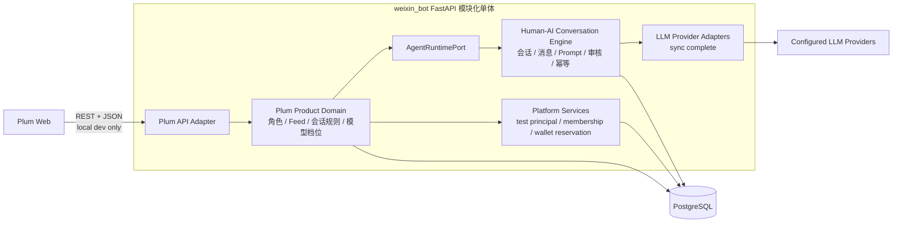
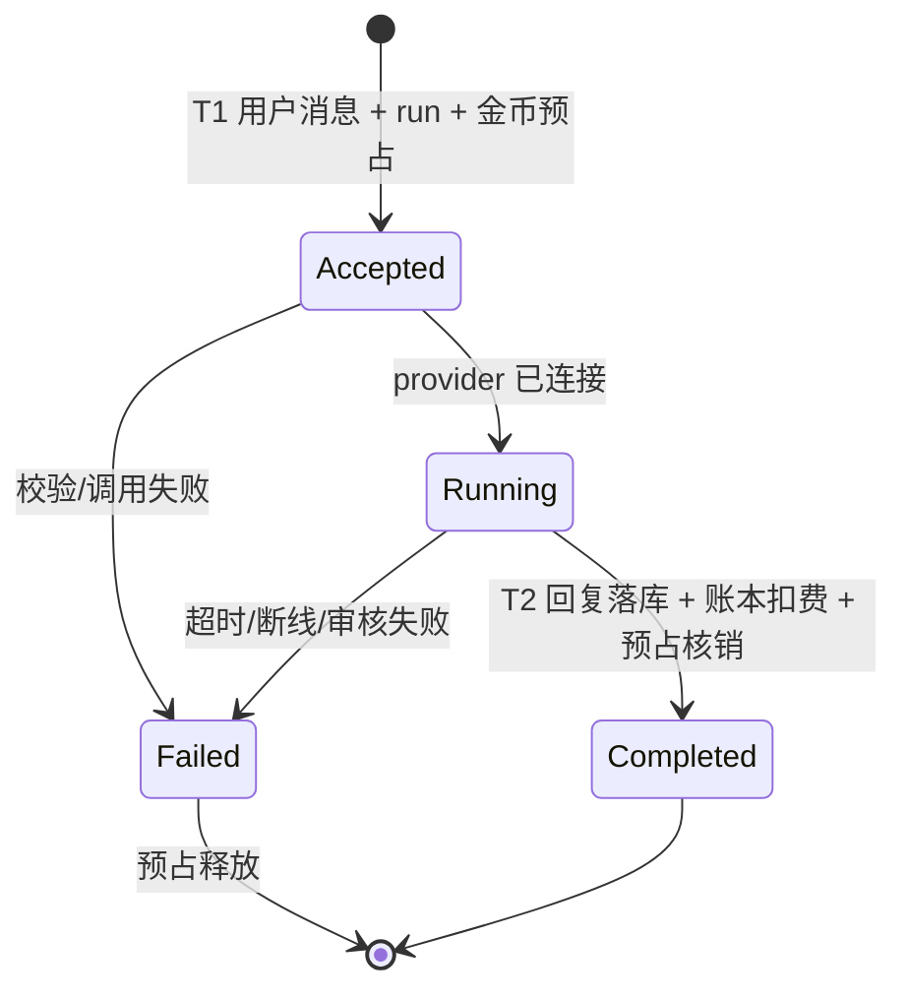

# Plum Chat MVP 后端技术方案

> 文档编号：TECH-03
> 版本：v0.3
> 状态：MVP 实现与联调基线
> 日期：2026-08-06
> 代码分支：`weixin_bot@codex/plum-mvp`
> 上游文档：[PRD](./PRD-MVP-v0.1.md) · [总体架构](./TECH-01-architecture.md)

## 1. 结论

Plum 不新建独立后端，也不把鸣蝉的 Feed、World 或居民业务复制过来。它应作为 `weixin_bot` 模块化单体中的第三个产品，以 `app_id=plum` 接入：

```text
FastAPI 模块化单体
├── app/platform/                 # 复用：身份、钱包、配额、审核、观测、数据库能力
├── app/agent_runtime/            # 复用并扩展：人—AI 对话核心、Prompt、模型、消息、provider 选择
└── app/products/plum/           # 新增：角色、Feed、会话产品规则、模型档位、API
```

固定公开命名空间为：

```text
/api/v1/products/plum/*
```

不能通过 `X-App-ID` 或其他客户端参数动态选择产品，也不能让 Plum import `zhaoxi` 或 `mingchan` 的产品实现。

## 2. 代码调研结论

| 能力 | 当前实现 | Plum 决策 |
| --- | --- | --- |
| 产品注册与路由 | `app/bootstrap/product_registry.py`、产品 `manifest.py` | 新增 Plum registration 与 manifest，沿用固定 namespace |
| 产品身份隔离 | `SessionPrincipal`、`product_memberships`、session audience | 邀请码绑定稳定用户并签发 Plum Cookie session；本地保留固定账号 fallback |
| 人—AI turn | `DefaultAgentRuntimeAdapter` → `run_product_turn()` | 首版同步复用完整链路，不复制对话引擎 |
| Prompt/上下文 | `ProductTurnServices`、`ProductPromptContext`、account profile files | Plum 实现自己的 `PlumTurnServices`，向 Runtime 投影中性上下文 |
| 消息历史 | 共享 `sessions` / `messages`，以 runtime `account_id` 隔离 | 复用；角色会话只保存映射，不另建一套正文消息表 |
| 模型 | `LLMProviderConfig`、family/tier、显式 `provider_id` 解析 | 复用 provider；Plum 维护 `fast/balanced/immersive` 到 provider 的产品映射 |
| 钱包 | 按 `(platform_user_id, app_id)` 隔离的 wallet/ledger/cost | 复用；前端称“金币”，后端保持 shell micros 记账单位 |
| 新客赠送 | `grant_new_user_shells()`，默认正好 1000 | 直接复用，保证 Plum 产品内一次性赠送 |
| Feed | 鸣蝉存在产品 Feed | 不复用业务模型；Plum 建自己的角色与 Feed 查询 |
| 响应方式 | 当前 LLM adapter 同步返回完整 JSON | 首版直接使用；流式 adapter 留到后续增强 |
| 用户入口 | `platform_users.phone` 当前 `NOT NULL UNIQUE` | 不改用户 schema；邀请码首次兑换创建独立测试账号，手机号字段使用不可投递占位 |
| 固定金额并发扣费 | 共享 Runtime 默认按 token 计费 | 新增通用固定金额预占/失败释放，并允许产品关闭 Runtime usage 计费；Plum 决定 1/3/5 金币价格 |

最接近的参考代码是鸣蝉居民对话，但它仅用于验证接入方式：Plum 不复用鸣蝉的 World、Feed、居民、生命周期或数据表。

## 3. 复用边界

### 3.1 必须复用的通用能力

- 人—AI 对话主链：输入规范化、幂等、会话、消息、Prompt、上下文裁剪、审核、模型调用、用量、错误与观测。
- runtime account、`sessions`、`messages` 和 account profile files。
- `ProductTurnServices` 与 `AgentRuntimePort` 的依赖方向。
- LLM provider 注册、密钥、协议适配、超时、重试和 usage。
- 平台用户、产品 membership、产品 audience session。
- 产品隔离的钱包、账本、配额与 PostgreSQL/SQLite 双后端能力。
- PG advisory lock、数据库事务、幂等键、日志和 request ID。

### 3.2 必须留在 Plum 产品域的能力

- 角色卡及其公开/私有字段。
- 主 Feed 的筛选、排序和卡片投影。
- “同一用户与同一角色默认一个活跃聊天”的规则。
- 角色开场白、重新开始、角色版本快照。
- `fast/balanced/immersive` 的产品名称、价格和启停规则。
- Plum 的 API DTO、错误文案和埋点名称。

### 3.3 不应复用的实现

- 不把鸣蝉 `universe`、`resident`、`ai_conversations` 或 Feed 表当成 Plum 的角色模型。
- 不把朝夕 onboarding、Dreaming、主动消息或提醒工具带入 Plum MVP。
- 不为“统一 Feed”抽象共享 repository 或共享表。
- 不在 Runtime 中增加 `if app_id == "plum"` 分支。

## 4. 目标架构



逻辑依赖固定为：

```text
Plum API → Plum application/domain → AgentRuntimePort → Agent Runtime
                              └──────→ Platform ports
```

Runtime 和 Platform 不反向 import Plum；产品包之间不互相 import。

## 5. 目录与代码落点

### 5.1 新增 Plum 垂直切片

```text
app/products/plum/
├── api/
│   ├── app.py                   # bootstrap/feed/conversation/同步 turn 路由
│   ├── contracts.py             # Pydantic DTO
│   └── deps.py                  # 固定 Plum 开发身份
├── application/
│   └── turn_services.py         # PlumTurnServices
├── infrastructure/
│   └── repository.py            # 角色、模型、绑定、会话和 seed
├── tools/
│   └── registry.py              # MVP 空工具 allowlist
└── manifest.py                  # 固定 namespace 注册
```

### 5.2 共享模块的最小加性改动

```text
app/agent_runtime/turns/service.py
├── ChannelTurnInput.provider_id             # 产品选择 provider，Runtime 不感知档位
└── ChannelTurnInput.usage_billing_enabled   # 外部固定价产品关闭 token 计费

app/db/
├── runtime_ownerships.py                    # 中性 runtime owner 投影
└── billing.py                               # 固定金额 reserve/release
```

现有 `run_product_turn()` 和 `DefaultAgentRuntimeAdapter.send_turn()` 保持外部行为不变。朝夕、鸣蝉默认继续按 usage 计费；只有 Plum 显式关闭该计费并在产品 API 外层管理固定价预占。

## 6. 首版通用人—AI 对话接入

首版直接调用 `run_product_turn()`：Plum 在产品层解析 `fast/balanced/immersive`，把中性的 `provider_id` 投影到 `ChannelTurnInput`；角色 Prompt、上下文、消息落库、审核和生成仍由共享 Runtime 完成。

固定价 turn 在调用 Runtime 前原子预占 1/3/5 金币，传入 `usage_billing_enabled=False` 防止 Runtime 再做按 token 扣费；成功回复保留该预占，异常或无有效回复时幂等释放。每日 turn 配额仍按共享 Runtime 的成功谓词结算。

### 6.1 后续流式增强（不属于 MVP）

#### 为什么不能在 Plum 内私建流式 turn

当前路径在 `app/agent_runtime/llm/adapters.py::chat_completion()` 中等待供应商返回完整 JSON，`run_product_turn()` 最终返回一个 `OpenClawTurnResponse`。它没有 delta、流状态或断线恢复契约。

Plum 不应绕过它另写一套 Prompt 和消息逻辑。正确做法是把现有阶段抽成一个共享引擎，并提供同步与流式两个 adapter：

```text
prepare → persist/screen inbound → build prompt → invoke model → finalize
                                      │
                         sync collector 或 stream emitter
```

### 6.2 后续中性 Runtime 契约

示意类型：

```python
@dataclass(frozen=True)
class RuntimeTurnOptions:
    provider_id: str
    response_mode: Literal["complete", "stream"]

RuntimeTurnEvent = (
    TurnAccepted | TurnDelta | TurnCompleted | TurnFailed
)

class StreamingAgentRuntimePort(Protocol):
    def stream_turn(
        self,
        ctx: ChannelTurnInput,
        *,
        options: RuntimeTurnOptions,
        lifecycle: TurnLifecycleParticipant | None = None,
    ) -> Iterator[RuntimeTurnEvent]: ...
```

约束：

- `RuntimeTurnOptions` 只表达 provider 和传输模式，不出现 Plum 模型档位。
- `TurnLifecycleParticipant` 是中性的事务参与者；Plum 可用它在成功终结事务中核销预占，Runtime 不认识金币。
- 事件只包含 runtime account、session、message、usage、provider 和错误等中性字段。
- `completed` 必须在完整 assistant message 已落库、终结事务已提交后发出。
- `failed` 后不得继续发 delta；同一个 run 只能有一个终态。
- Plum MVP 的工具 allowlist 为空；流式工具调用不作为本期交付条件。

### 6.3 模型流式适配

使用现有 `httpx`，不新增 SDK 依赖：

- OpenAI Chat 兼容协议：`httpx.Client.stream()` + SSE 行解析。
- OpenAI Responses、Anthropic Messages：只有在 Plum 启用对应 provider 时才必须实现其流协议。
- 启动时校验所有启用的 Plum 模型档位都支持 stream；不支持则 fail closed，不静默退回错误模型。
- 解析器输出统一 `text_delta`、`usage`、`finish_reason` 和归一化错误。
- delta 只表达新增文本，不返回累计全文。

### 6.4 流式审核

现有最终全文同步 guard 不能直接保护已经发出的 token。MVP 使用“受控缓冲流”：

1. provider delta 先进入小缓冲区；
2. 按句末或长度阈值调用平台输出审核；
3. 仅发送已放行文本；
4. 结束时对完整文本再做一次最终校验；
5. 未放行文本不写 completed message，也不扣金币。

缓冲阈值是平台技术配置，不属于角色或 Feed 业务。

## 7. 身份、账号与所有权

### 7.1 公网测试账号与开发 fallback

公网内测不实现匿名身份，也暂不修改 `platform_users.phone` 约束或接入手机号/SMS。通过 `scripts/create_plum_access_invite.py` 生成一人一码；数据库只保存 SHA-256 哈希，明文只在创建时输出。首次兑换时准备：

```text
platform_users
└── id = user_<random>
    phone = <invite-id>@plum-invite.invalid

product_memberships
└── platform_user_id = user_<random>, app_id = plum
```

同时创建用户独立的 Plum 入口 account、runtime owner、钱包、默认 Persona，并通过现有产品级新客赠送语义初始化 1000 金币。同一邀请码再次兑换恢复同一用户，不重复赠送。

Plum API 优先使用产品私有 Cookie principal：

- `POST /auth/access-code` 兑换邀请码并签发 HttpOnly session 与 CSRF Cookie。
- session 固定 `app_id=plum`；解析时校验未过期且 membership active。
- 所有登录后写请求校验 `plum_csrf` 与 `X-Plum-CSRF`。
- 登录接口按来源 IP 限流；生产环境要求 Secure Cookie。
- Cookie 缺失或无效返回 `401`，不接受 Header、query 或 body 中的 user ID。

`scripts/seed_plum_dev.py` 和固定测试 principal 继续保留，但仅在 `local/development/test + PLUM_DEV_MODE=true` 生效，生产环境不可回退。

### 7.2 runtime account 所有权

Plum 需要“每个用户 × 角色一个 runtime account”，但现有 owner resolver 只认识微信 binding 和鸣蝉 universe。不能让共享 resolver import Plum 表。

本次真实需求已经满足建立通用所有权投影的条件，建议新增：

```text
runtime_ownerships
├── runtime_account_id       PK/FK accounts.id
├── platform_user_id         FK platform_users.id
├── app_id
├── owner_kind               user
├── source_type              product_entry | character_binding | legacy_binding | universe_resident
├── source_id
├── status
└── created_at / updated_at
```

迁移要求：

- 从有效 `account_owner_bindings` 和鸣蝉 resident→universe owner 回填。
- 之后所有 runtime account 创建路径在同一事务写 `runtime_ownerships`。
- `resolve_owner_platform_user_id()` 改为只读该投影，避免长期维护多个所有权事实源。
- `(runtime_account_id, app_id)` 与 `accounts.app_id` 必须一致。

同时把 `insert_resident_runtime_account()` 中真正通用的 account/profile 创建部分提取为 `insert_runtime_account()`；旧函数保留薄包装，Plum 只调用中性原语。

### 7.3 开发 seed 事务

开发 seed 在一个数据库事务中幂等执行：

1. 插入或确认固定 `platform_user`；
2. 创建 `product_membership(app_id=plum)`；
3. 创建一个 Plum 产品入口 account 与 `runtime_ownerships`；
4. `grant_new_user_shells_in_conn()` 写入产品级一次性 1000 赠送；
5. 提交并输出非敏感的测试用户 ID、余额和执行状态。

重复运行 seed 不创建第二个用户、入口 account、钱包或赠送流水。余额重置另做显式开发脚本，不能复用新客赠送幂等键绕过账本。

入口 account 只作为产品钱包和用户级技术锚，不承担角色 persona；角色 runtime account 在首次进入该角色时再创建。

## 8. Plum 产品数据模型

### 8.1 `plum_characters`

Plum 私有业务表，不抽象成共享 Feed：

| 字段 | 说明 |
| --- | --- |
| `id` | 稳定角色 ID |
| `display_name`、`tagline`、`intro`、`greeting` | 公开内容 |
| `tags_json`、`heat_count`、`avatar_ref`、`cover_ref` | 卡片资产 |
| `persona_prompt`、`scenario_prompt`、`speaking_style` | 私有 prompt 资产 |
| `prompt_version` | 角色版本 |
| `status` | draft/active/inactive |
| `sort_order` | Plum 主 Feed 顺序 |
| `created_at`、`updated_at` | 审计字段 |

只有产品 repository 能读取私有 prompt；Feed API 使用显式 public projection。

### 8.2 `plum_character_bindings`

表示用户与角色的长期 runtime 关系：

| 字段 | 说明 |
| --- | --- |
| `platform_user_id` + `character_id` | 联合唯一 |
| `runtime_account_id` | 联合唯一并指向共享 account |
| `character_prompt_version` | 首次绑定时的人设快照版本 |
| `status` | active/inactive |

首次绑定时，把该版本的人设写入 runtime account 的 `SOUL.md` / `IDENTITY.md`。正式角色资产更新是否影响既有用户由后续产品规则决定，MVP 默认不追溯更新。

### 8.3 `plum_conversations`

表示 Plum 的产品会话规则，不存消息正文：

| 字段 | 说明 |
| --- | --- |
| `id` | conversation ID |
| `platform_user_id`、`character_id` | owner 与角色 |
| `runtime_account_id`、`runtime_session_id` | 指向共享对话状态 |
| `model_profile` | fast/balanced/immersive |
| `status` | active/archived |
| `created_at`、`updated_at`、`archived_at` | 审计字段 |

约束：同一 `(platform_user_id, character_id)` 最多一个 active conversation。重新开始时归档旧 conversation 和当前 runtime session，在同一 runtime account 下创建新 session；旧消息仍可审计，但不会进入新会话上下文。

### 8.4 `plum_model_profiles`

| 字段 | 说明 |
| --- | --- |
| `profile` | fast/balanced/immersive，主键 |
| `provider_id` | 指向共享 LLM provider 配置 |
| `display_name`、`description` | Plum 展示文案 |
| `coin_cost_micros` | 1/3/5 × 1,000,000 |
| `enabled`、`is_default` | 产品控制 |
| `config_version` | 快照版本 |

Plum profile 不能改写共享的 active family/tier，否则会影响其他产品。每次 turn 必须快照 `provider_id`、价格和配置版本。

### 8.5 后续共享 `agent_turn_runs`（非 MVP）

若后续实现流式和断线恢复，可增加人—AI 对话核心的技术状态；它不是 Plum generation 业务表：

| 字段 | 说明 |
| --- | --- |
| `id`、`app_id`、`account_id`、`session_id` | 运行标识和隔离锚 |
| `client_message_id`、`inbound_message_id`、`reply_message_id` | 消息幂等关联 |
| `provider_id`、`model` | 模型快照 |
| `status` | accepted/running/completed/failed/timed_out |
| `input_tokens`、`output_tokens`、`finish_reason` | usage |
| `error_code`、`request_hash` | 错误与同键异参检测 |
| `first_delta_at`、`completed_at`、`created_at` | 时延与恢复 |
| `metadata_json` | 产品中性扩展元数据 |

唯一约束：`(app_id, account_id, client_message_id)`；每个 session 最多一个 accepted/running run。

流式 delta 不逐 token 落库。刷新时只恢复 run 状态；completed 后从 `messages` 读取完整回复。

## 9. 金币方案

### 9.1 复用现有钱包

后端继续使用共享单位：

```text
1 金币（Plum 展示） = 1 shell = 1,000,000 shell_micros
```

`entitlement_wallets` 已按 `(platform_user_id, app_id)` 隔离；Plum 不新建 `coin_wallet` 或 `coin_ledger`。Plum API 将单位标签映射为“金币”，不能直接返回现有 `get_wallet_summary()` 中硬编码的“贝壳”展示 DTO。

### 9.2 为什么不能直接调用现有扣费

`record_chat_usage_charge()` 按 token 计算费用；Plum 是固定 1/3/5 金币。同时底层通用 debit 当前没有“余额不可为负”的条件更新，不能直接承担多标签页并发扣费。

### 9.3 通用固定金额预占

首版不新增 reservation 状态表，直接以共享账本实现：

- `reserve_fixed_shells()` 使用条件更新 `balance >= amount` 原子扣减，并写 `fixed_reservation` debit ledger；同一幂等键重放不重复扣款。
- 成功回复无需第二次 capture，预占 debit 即最终固定价格消费。
- `release_fixed_shell_reservation()` 在生成失败时写幂等 credit ledger 退回原金额。
- Plum 调用 Runtime 时设置 `usage_billing_enabled=False`，避免固定价之外再产生 `usage_charge`。

价格决定在 Plum，原子条件更新、账本和幂等语义在 Platform。若后续引入长时间流式任务，再评估独立 reservation 状态表与过期回收。

## 10. API 设计

所有接口固定前缀：

```text
/api/v1/products/plum
```

| 方法与路径 | 说明 |
| --- | --- |
| `GET /bootstrap` | 返回预置测试用户、余额、模型列表和开发模式状态 |
| `GET /feed` | 返回 Plum 主 Feed 角色公开投影 |
| `POST /conversations` | 获取或创建某角色的 active conversation |
| `GET /conversations/{id}` | 返回会话、消息、模型列表和余额 |
| `PATCH /conversations/{id}/model` | 保存模型档位 |
| `POST /conversations/{id}/restart` | 归档并新建 session |
| `POST /conversations/{id}/turns` | 发送纯文本并同步返回完整 reply、扣费和余额 |

端点不暴露 system prompt、provider 密钥或真实内部 context 文件。

### 10.1 发送请求

```http
POST /api/v1/products/plum/conversations/{conversation_id}/turns
Content-Type: application/json
```

```json
{
  "client_message_id": "uuid",
  "idempotency_key": "uuid",
  "text": "外面的雨还会下多久？"
}
```

模型以服务端 conversation 当前已提交值为准。前端必须等待 `PATCH` 成功后才允许发送；`POST turn` 在受理时读取并快照 profile/provider/price。MVP 没有跨标签页的会话 single-flight，多个标签页同时切换时以数据库最后提交值为准。

### 10.2 同步成功响应

```json
{
  "status": "ok",
  "reply": {"message_id": "msg_a", "text": "雨会慢慢停的。"},
  "charged_coins": 3,
  "wallet": {"balance": 997, "balance_micros": 997000000, "unit": "金币"},
  "deduplicated": false
}
```

失败在 HTTP 层返回稳定 `detail`，例如余额不足为 `402 insufficient_coins`，已退款请求 ID 重放为 `409 idempotency_key_already_released`，模型不可用为 `503 model_provider_unavailable`，生成异常为 `502 generation_failed`。生成异常会先幂等释放固定金额预占；用户重试必须生成新的 UUID。

SSE 事件协议、断线恢复和 turn run 查询属于后续流式增强，不是首版 API。

## 11. 后续流式 turn 状态机（非 MVP）



### T1：受理短事务

1. 开发态依赖解析固定 Plum 测试 principal，校验 conversation owner 与 active 状态。
2. 获取中性的 session/account turn lock；检查幂等键和 active run。
3. 读取 conversation 当前 model profile，快照 provider、价格和配置版本。
4. 预占金币；不足返回 `COIN_INSUFFICIENT`。
5. 通过共享引擎保存用户消息并创建 `agent_turn_runs(accepted)`。
6. 提交后发 `accepted`。

不能在数据库事务中等待模型返回。

### 生成阶段：事务外

1. Plum `ProductTurnServices` 从 runtime account profile files 生成中性 prompt context。
2. 共享引擎读取当前 session 历史并构建 Prompt。
3. 按快照的 `provider_id` 打开 provider stream。
4. 审核后发送 delta，在内存累计完整文本与 usage。

### T2：成功短事务

1. 锁 run 与 wallet/reservation，确认仍为 running/pending。
2. 共享引擎写完整 assistant message、usage 和 completed run。
3. Platform 核销 reservation、条件扣减余额、写 ledger/cost event。
4. 同一事务提交后发 `completed`。

消息完成与固定金额扣费同成同败。

### T3：失败短事务

1. 标记 run failed/timed_out，记录稳定错误码。
2. 释放 reservation；不写消费流水。
3. 用户消息保留，assistant completed message 不创建。
4. 提交后发 `failed`。

MVP 不引入独立 turn run 表或消息队列。进程在预占后被强制终止可能留下无法自动回收的 debit，这是本地 MVP 的已知限制；公开部署前应增加 reservation 状态与超时回收。

## 12. 并发、幂等与锁序

- HTTP body 同时携带 `client_message_id` 和 `idempotency_key`，且二者必须相同；共享消息唯一键与固定扣费因此使用同一个请求身份。
- 钱包通过 `UPDATE ... WHERE balance_shell_micros >= amount` 原子扣减；SQLite 与 PostgreSQL 走同一 repository 契约。
- 同一固定扣费键重放只返回已有 ledger；失败释放键固定为 `release-{reservation_key}`，因此重复释放不重复退款。已经释放的键不能再次预占。
- 角色 binding 与 active conversation 由唯一约束兜底，所有 owner 查询显式约束 `platform_user_id`。
- 重开会话归档旧 conversation/session 并创建新 session；旧消息不进入新 Prompt。
- 后续若允许多个真实用户或并发流式任务，再增加明确的会话 single-flight 锁和同键异参 hash 校验。

## 13. 错误契约

首版使用 FastAPI JSON 错误响应，稳定值位于 `detail`：

| detail | HTTP | 说明 |
| --- | ---: | --- |
| `plum_dev_identity_disabled` | 403 | 非本地环境或开发身份未启用 |
| `plum_dev_seed_required` | 503 | 测试账号或 membership 未准备好 |
| `conversation_not_found` | 404 | 会话不存在或非 owner |
| `model_profile_unavailable` | 503 | 当前档位不可用 |
| `model_provider_unavailable` | 503 | provider 未启用 |
| `insufficient_coins` | 402 | 固定金额预占失败 |
| `generation_failed` | 502 | 生成异常，预占已释放 |
| FastAPI validation detail | 422 | 空消息、长度或枚举校验失败 |

越权访问与不存在使用不泄露 owner 的响应。日志不记录 API key 或完整 system prompt。

## 14. 数据迁移顺序

当前实现新增 schema migration 64：

1. 创建中性 `runtime_ownerships` 投影和索引。
2. 创建 `plum_characters`、`plum_character_bindings`、`plum_model_profiles`、`plum_conversations` 及约束。
3. 固定金额扣费复用既有 wallet/ledger 表，不新增 Plum 钱包表或流式 run 表。

固定测试用户属于本地 seed 数据，不写进 schema migration，也不进入生产数据库迁移。

每个迁移必须：

- 同时支持 PostgreSQL 与 SQLite。
- 可重复执行，包含回填校验与约束建立前的 precheck。
- 不通过修改 baseline 假装迁移完成。
- 生产由 central 显式执行，不能依赖普通 API worker 自动迁移。

## 15. 配置

当前配置：

```text
PLUM_ENABLED=true
PLUM_DEV_MODE=true
PLUM_TEST_USER_ID=user_plum_test
PLUM_TEST_PHONE=plum-test@local.invalid
PLUM_FAST_PROVIDER_ID=deepseek
PLUM_BALANCED_PROVIDER_ID=chatgpt
PLUM_IMMERSIVE_PROVIDER_ID=deepseek-v4-pro
PLUM_PUBLIC_TEST_AUTH_ENABLED=true
PLUM_SESSION_COOKIE_NAME=plum_session
PLUM_CSRF_COOKIE_NAME=plum_csrf
PLUM_SESSION_DAYS=30
PLUM_SESSION_COOKIE_SECURE=false
```

测试账号手机号字段使用不可投递的本地域名占位，不是真实手机号。模型映射由配置引用现有 provider ID，不允许内联 API key。生产应设置 `PLUM_DEV_MODE=false`、`PLUM_PUBLIC_TEST_AUTH_ENABLED=true` 和 `PLUM_SESSION_COOKIE_SECURE=true`；任一不安全回退都会 fail closed。

## 16. 测试与验收

### 16.1 共享能力测试

- 现有同步 `send_turn()` 回归不变。
- `runtime_ownerships` 回填后，朝夕与鸣蝉 owner 解析结果不变。
- reservation 在并发下不透支，reserve/release 幂等，余额永不为负。
- `usage_billing_enabled=False` 时跳过 token 计费，但不改变成功 turn 的配额结算。

### 16.2 Plum 产品测试

- 开发 seed 重复执行仍只有一个测试用户、Plum membership、入口 account、钱包和 1000 赠送流水。
- `PLUM_DEV_MODE` 在 production fail closed，客户端传入 user ID 不会改变 principal。
- Feed 只返回 active 角色公开字段，绝不返回 prompt。
- 同一用户/角色并发创建只产生一个 binding 和 active conversation。
- 首轮与后续 turn 使用 Plum `ProductTurnServices`，不 import 其他产品。
- 模型切换从下一轮生效，已受理 run 使用自己的配置快照。
- 成功回复扣 1/3/5 金币；失败、超时、审核拦截不扣费。
- 余额 5 时两个 5 金币并发请求只有一个能预占成功。
- 重新开始后旧消息不进入新 session Prompt。
- 同一幂等键重放不重复预占或扣费。

### 16.3 必跑回归

```text
tests/test_layer_boundaries.py
tests/test_multi_product_isolation.py
tests/test_session_principal.py
tests/test_billing_concurrency_pg.py
tests/test_plum_mvp.py（API / turn / fixed billing / migration）
```

持久化、计费和 migration 同时跑 SQLite 与 PostgreSQL；生产验收以 PostgreSQL 为准。

## 17. 实施批次

### 批次 A：产品骨架与身份

- 注册 `PLUM_APP_ID`、manifest、固定 namespace 和 feature flag。
- 完成测试账号 seed、开发态 principal、membership、entry account、runtime ownership 与 1000 金币赠送。
- 提供 `/bootstrap`、`/wallet`。

### 批次 B：Plum 业务域

- 建角色、binding、conversation、model profile 表。
- 导入 2 个调试角色。
- 提供 Feed、会话创建/历史、切换模型、重新开始。

### 批次 C：通用同步对话接入

- 复用现有 turn A/B/C/D 阶段。
- 增加中性 `provider_id` 与外部固定价计费开关。
- 保持朝夕、鸣蝉默认 provider 与 usage 计费回归。

### 批次 D：金币结算与端到端

- 增加固定金额 reservation/release。
- 接通 Plum 同步 POST JSON、失败释放、历史恢复。
- 完成 PG 并发、跨产品隔离和前端联调。

## 18. 联调门槛与后续项

本地联合验收前必须满足：

- `plum` 固定 audience 与跨产品隔离测试通过。
- 所有启用模型档位都有可用的同步 provider 实现。
- 余额无负数、无重复赠送、无重复扣费。
- 角色私有 prompt 不出现在 API、日志或前端 bundle。
- PG migration、回滚预案、超时 run/reservation 清理经过演练。
- `PLUM_ENABLED` 可独立关闭且不影响朝夕、鸣蝉。

当前已满足邀请码公网多人内测的 session、用户级隔离和同码恢复要求；它仍不是正式消费者账号体系，邀请码泄露等同临时账号凭证泄露。

以下不进入本地 MVP：SSE 流式输出、统一 Feed 平台、支付/充值、图片/语音、工具调用、长期记忆产品化、主动消息、跨设备账号找回。它们应在真实需求出现后再扩展，不提前下沉到共享层。
